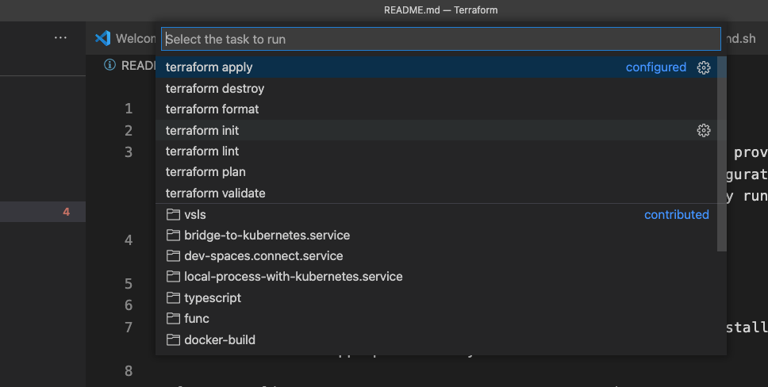

# Running Terraform in VS Code

[Terraform](https://www.terraform.io/) is an open-source tool that provides the ability to build, change, and version infrastructure as code using declarative configuration files with HashiCorp Configuration Language (HCL). This recipe shows how to successfully run Terraform with minimal setup with VS Code.

## Getting Started

- [Visual Studio Code](https://code.visualstudio.com/download): Install the latest version of Visual Studio Code that is appropriate for your environment.

- [Terraform](https://www.terraform.io/downloads.html): Download the latest version of Terraform that is appropriate for your environment.

- [Terraform Extension](https://marketplace.visualstudio.com/items?itemName=HashiCorp.terraform): The HashiCorp Terraform VS Code extension adds syntax highlighting and other editing features for Terraform files using the Terraform Language Server.

- [Terraform Linter](https://github.com/terraform-linters/tflint)

## Configuring the Terraform Tasks

The tasks below are based on Microsoft Azure as the cloud provider but other cloud providers such as AWS and Google Cloud are also supported with Terraform.

Add/Update your vscode settings.json with:

```json
{
    "terraform": {
        "azurerm": {
            "tenant_id": "",
            "subscription_id": "",
            "location": "eastus",
            "backend": {
                "resource_group": "rg-trfrm-recipe",
                "storage_account": "sttrfrmrecipe",
                "container": "infrax",
                "key": "infrax.tfstate"
            }
        }
    },
    "sample": {
        "rg_name": "rg-sample"
    }
}
```

The following values will need to be updated from the configuration:

- `tenant_id`: Azure tenant ID
- `subscription_id`: Azure subscription ID
  > Ensure you have permissions to create resources in this subscription.

The following values can be renamed from the above configuration:

- `location`: Location where the resource group for the backend should be created
- `resource_group`: Name of the resource group where the storage account should be created
- `storage_account`: Name of the storage account for the backend
- `container`: Name of the container within the storage account
- `key`: Name of the blob used to retrieve/store Terraform's state file
- `rg_name`: Name of the resource group to be provisioned with Terraform

Add the following `shell` task to your tasks.json file:

```json
{
    "version": "2.0.0",
    "windows": {
        "options": {
            "shell": {
                "executable": "cmd.exe",
                "args": ["/d", "/c"],
            },
        }
    },
    "tasks": [
        {
            "label": "az login",
            "type": "shell",
            "command": "az login && az account set -s ${config:terraform.azurerm.subscription_id}",
            "problemMatcher": []
        },
        {
            "label": "terraform create backend",
            "type": "shell",
            "windows": {
                "command": "${workspaceFolder}/create-backend.bat"
            },
            "linux": {
                "command": "${workspaceFolder}/create-backend.sh"
            },
            "command": "${workspaceFolder}/create-backend.sh",
            "problemMatcher": [],
            "args": [
                "${config:terraform.azurerm.backend.resource_group}",
                "${config:terraform.azurerm.backend.storage_account}",
                "${config:terraform.azurerm.backend.container}",
                "${config:terraform.azurerm.location}"
            ]
        },
        {
            "label": "terraform init",
            "type": "shell",
            "command": "terraform",
            "problemMatcher": [],
            "args": [
                "init",
                "-backend-config=\"resource_group_name=${config:terraform.azurerm.backend.resource_group}\"",   
                "-backend-config=\"storage_account_name=${config:terraform.azurerm.backend.storage_account}\"",
                "-backend-config=\"container_name=${config:terraform.azurerm.backend.container}\"",
                "-backend-config=\"key=${config:terraform.azurerm.backend.key}\"",                           
                "-backend-config=\"subscription_id=${config:terraform.azurerm.subscription_id}\"",
                "-backend-config=\"tenant_id=${config:terraform.azurerm.tenant_id}\"",
            ],
            "options": {
                "cwd": "${workspaceFolder}/templates"
            }
        },
        {
            "label": "terraform validate",
            "type": "shell",
            "options": {
                "cwd": "${workspaceFolder}/templates"
            },
            "command": "terraform",
            "problemMatcher": [],
            "args": [
                "validate"
            ]
        },
        {
            "label": "terraform format",
            "type": "shell",
            "options": {
                "cwd": "${workspaceFolder}/templates"
            },
            "command": "terraform",
            "problemMatcher": [],
            "args": [
                "fmt",
                "--recursive"
            ]   
        },
        {
            "label": "terraform lint",
            "type": "shell",
            "options": {
                "cwd": "${workspaceFolder}/templates"
            },
            "command": "tflint",
            "problemMatcher": []
        },
        {
            "label": "terraform plan",
            "type": "shell",
            "options": {
                "cwd": "${workspaceFolder}/templates"
            },
            "command": "terraform",
            "problemMatcher": [],
            "args": [
                "plan",
                "-var=rg_name=${config:sample.rg_name}"
            ]
        },
        {
            "label": "terraform apply",
            "type": "shell",
            "options": {
                "cwd": "${workspaceFolder}/templates"
            },
            "command": "terraform",
            "problemMatcher": [],
            "args": [
                "apply",
                "-var=rg_name=${config:sample.rg_name}"
            ]
        },
        {
            "label": "terraform destroy",
            "type": "shell",
            "options": {
                "cwd": "${workspaceFolder}/templates"
            },
            "command": "terraform",
            "problemMatcher": [],
            "args": [
                "destroy",
                "-var=rg_name=${config:sample.rg_name}"
            ]
        },
    ]
}
```

## Running the Terraform Commands

### Using the VS Code Tasks

VS Code tasks have been configured to run commonly used commands. These can be accessed via `CTRL/Command+SHIFT+P` > `Tasks: Run Tasks`.



Once the settings are configured, you can begin executing terraform commands.

### Running the Tasks

Once the environment settings are configured, and the backend has been created, you can begin executing terraform commands. VS Code tasks have been configured to run each of the commonly used terraform commands. These can be accessed via `CTRL/Command+SHIFT+P` > `Tasks: Run Tasks`.

- `az login`: login to Azure and set your default subscription
- `terraform create backend`: create (if it does not exists) a remote azurerm backend (storage account)
- `terraform init`: installs plugins and connect to terraform remote backend
- `terraform format`: fix formatting issues
- `terraform lint`: fix linting issues
- `terraform validate`: check templates for syntax errors
- `terraform plan`: report what would be done with apply without actually deploying any resources
- `terraform apply`: deploy the terraform templates
- `terraform destroy`: destroy resources deployed with the templates

## Sample Template

In this sample [template](templates/main.tf), we create and execute the basic Terraform configuration that will provision a new Azure Resource Group.

## Additional References

- [Terraform Overview](https://www.terraform.io/intro/index.html)
- [Terraform Tutorials](https://learn.hashicorp.com/terraform?utm_source=terraform_io)
